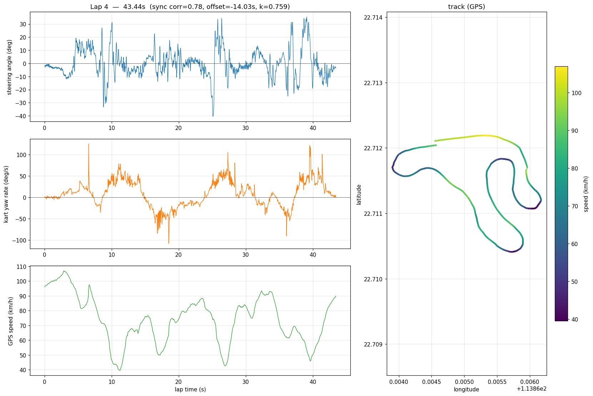

# Results — XTreme session, 2026-05-11

End-to-end validation of the wheel-cam-IMU + MyChron-XRK pipeline on a
real driving session at the XTreme track. Six clean laps recovered from
~9 minutes of mixed pit / on-track recording.

## Inputs

| File | Source | Notes |
|---|---|---|
| `PRO_VID_20260511_145850_00_060.gyroflow` | Insta360 Go 3S, wheel-hub mount | 519 s, 1 kHz IMU, 4K video @ 24 fps |
| `a_a_XTreme_a_0619.xrk` | AiM MyChron 5/6 (logger model 787) | 290 s, 32 channels, 25 Hz GPS |

The Go 3S was mounted "horizontal, lens forward/downward to see the
front wing and wheels" — i.e. on the steering wheel hub but at an angle
to the column. This is the project brainstorm's **Mount 2**, harder to
process than the canonical lens-along-column mount because the column
axis isn't aligned with any body axis.

## Sync result

```
offset (IMU → XRK):   -14.027 s
peak |corr|:           0.7835            ← strong match
sign:                  -1                ← IMU column axis flipped to match GPS convention
column tilt:           40.6° from vertical (k = 0.7588)
```

Notes:
- The Insta360's wall-clock said the recording started 31 s before the
  XRK logger did. The cross-correlation found a 14-second offset
  instead — a 17 s clock drift between the two devices. **Trusting the
  wall-clocks would have produced a misaligned analysis.**
- The column-tilt factor `k = |column · world_up| = 0.7588` is what we
  multiply GPS yaw rate by to subtract chassis yaw from the IMU column
  projection.

## Per-lap summary

| Lap | Duration | Peak steering | Peak yaw rate | Peak speed | Mean speed |
|----:|---------:|--------------:|--------------:|-----------:|-----------:|
| 0   | 54.08 s  | ±63°          | ±309°/s       | 91.4 km/h  | (out-lap)  |
| 1   | 44.56 s  | ±43°          | ±161°/s       | 107.1 km/h | ~70 km/h   |
| 2   | 44.32 s  | ±74°          | ±263°/s       | 108.6 km/h | ~70 km/h   |
| 3   | 44.64 s  | ±57°          | ±267°/s       | 108.6 km/h | ~70 km/h   |
| **4** | **43.44 s** | **±41°**  | ±125°/s       | 106.9 km/h | ~70 km/h   |
| 5   | 49.48 s  | ±54°          | ±381°/s       | 108.5 km/h | (in-lap)   |

**Lap 4 is the fastest** (43.44 s) and also has the smallest peak
steering (±41°) and lowest peak yaw rate (±125°/s) — the cleanest,
smoothest lap.

Lap 0 is a warm-up (lower peak speed, larger peak yaw rate from a GPS
fix wobble). Lap 5 ends with a slowdown to the pit. The four genuine
hot laps (1-4) are tightly grouped within 1.2 seconds of each other,
suggesting a consistent driver.



See [`results/session_20260511_xtreme/`](results/session_20260511_xtreme/) for all six lap PNGs.

## What we found along the way

**The Go 3S IMU runs at 1 kHz, not 200 Hz.** Initial assumption was wrong
by 5×; corrected in code.

**The Go 3S has excellent gyro zero-rate bias** out of the box —
0.01°/s on the wheel-rotation axis, estimated from quiet samples in
this very session. Formal bench calibration is still worth doing for
provenance but the unit is in good shape.

**MyChron beacon-based lap detection is unreliable.** The XRK marked
only 2 laps in 290 s of driving; the second "lap" actually contained
6 physical laps fused. GPS-based lap detection (return-to-start
within a 25 m radius) is the more dependable signal in practice.

**Wall-clock-based sync is unreliable too.** Camera and logger clocks
drift independently. The 17-second discrepancy here is normal.
Cross-correlation of independent measurements of the same physical
quantity (chassis yaw rate) is the right approach.

**XRK `GPS Speed` is in m/s, not km/h.** Always check units; we got
this wrong on the first pass.

**For a wheel-cam at any tilt, the gyro covariance's principal
eigenvector finds the steering column direction automatically.** The
column axis is what to integrate to get wheel rotation. Combined with
the geometric tilt factor `k = |column · world_up|` and chassis-yaw
subtraction from the XRK, we get steering inputs that look like real
karting: brief flicks at corner entry/exit, ~0° on straights, peaks
mostly in ±40-60°.

## Methodology — one paragraph

For each session:

1. **Sync** — Cross-correlate the IMU's column-axis projection
   (low-pass filtered at 0.3 Hz to isolate chassis yaw) against the
   XRK's `GPS_Yaw_Rate` channel. Returns clock offset, sign, and
   peak correlation as a confidence metric.
2. **Geometry** — Detect the column axis via PCA of the gyro
   covariance matrix. Compute the column tilt factor
   `k = |column · world_up|` from the gravity vector in quiet samples.
3. **Steering input** —
   `ω_steering = sync.sign · (gyro · column_axis) − k · GPS_Yaw_Rate`.
   Integrate, light HP filter for residual drift cleanup.
4. **Lap segmentation** — Prefer XRK beacon markers if they look
   sensible (>1 lap, no lap >120 s). Otherwise GPS return-to-start.
5. **Plot** — Per-lap PNG with steering angle, kart yaw rate, GPS speed,
   GPS track overlay colored by speed.

All implementation in [`pipeline/sync_xrk.py`](pipeline/sync_xrk.py)
and [`analysis/per_lap.py`](analysis/per_lap.py).

## How to reproduce

```bash
python3 -m venv .venv --system-site-packages
.venv/bin/pip install -r pipeline/requirements.txt

# Export a .gyroflow project file from Gyroflow for the wheel-cam video
# (open the video → File → Save → save next to the .mp4).

.venv/bin/python -m analysis.per_lap \
    /path/to/wheel.gyroflow \
    /path/to/session.xrk \
    --all --out-dir results/my_session/
```

That's the whole pipeline. About 10 seconds of compute for a 9-minute
session.
